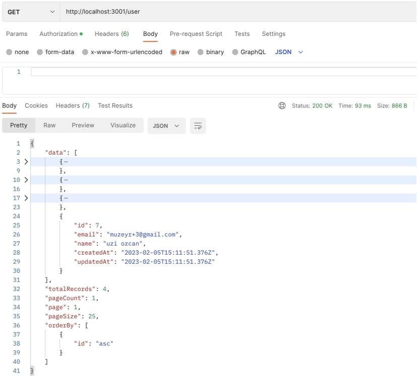
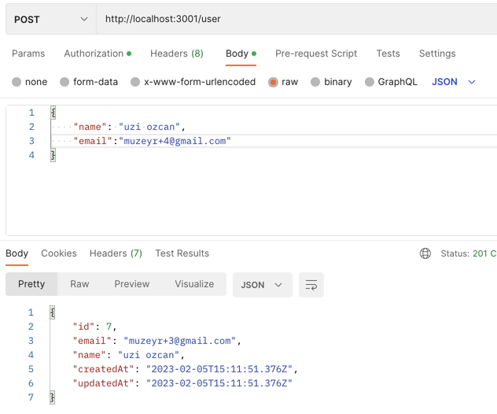
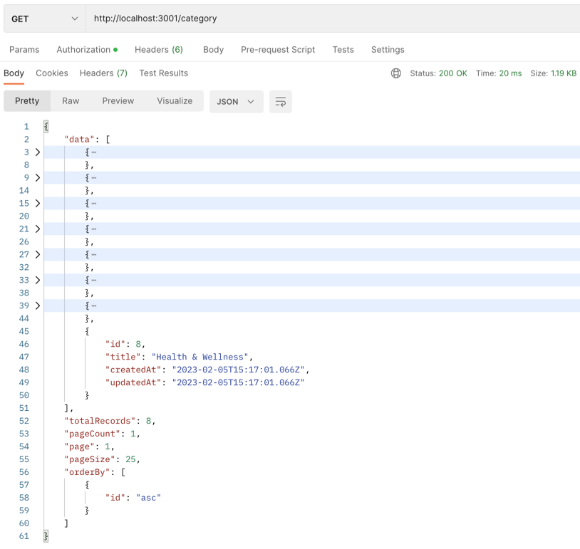
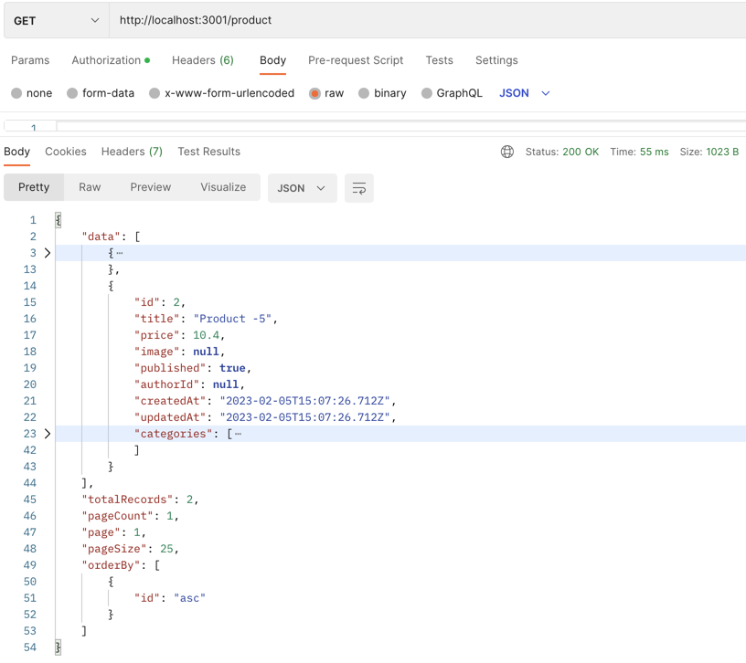
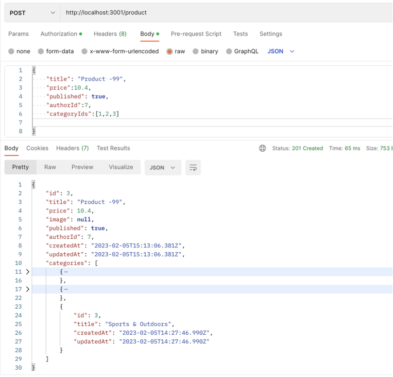

<p align="center">
  <a href="http://nestjs.com/" target="blank"></a>
</p>

[circleci-image]: https://img.shields.io/circleci/build/github/nestjs/nest/master?token=abc123def456
[circleci-url]: https://circleci.com/gh/nestjs/nest

  <p align="center">A progressive <a href="http://nodejs.org" target="_blank">Node.js</a> framework for building efficient and scalable server-side applications.</p>
    <p align="center">

NestJS application with integrated Prisma ORM for managing user, product, and category models using PostgreSQL as the database. To save time on CRUD operations, I used the npm library, nestjs-prisma-crud (https://kepelrs.github.io/nestjs-prisma-crud/). I also included a Postman collection, making testing the API even easier. Deployment is made simple with Docker, making it easy to run the project with just a few commands. As I noticed a lack of examples for relational models, I created this repository to showcase the implementation. Feel free to check it out and let me know your thoughts!

  ! #NestJS #Prisma #RelationalModels #WebDevelopment #nestjs-prisma-crud #Postman #PostgreSQL #Docker

## Description

[Nest](https://github.com/nestjs/nest) framework TypeScript starter repository.

## Installation

```bash
$ npm install
```

## Running the app

```bash
# development
$ npm run start

# watch mode
$ npm run start:dev

# production mode
$ npm run start:prod
```

## Test

```bash
# unit tests
$ npm run test

# e2e tests
$ npm run test:e2e

# test coverage
$ npm run test:cov

$ cp .env.example .env
```

## Docker File
Get started by running

```bash
$ docker build -t backend-nest-api .

$ docker run -p 3000:3000 --env-file .env -d backend-nest-api
```

### Docker Compose

 ```bash
$ docker-compose up 

$ docker-compose up -d # background
```


# Prisma
Create two database tables with Prisma Migrate#

 ```bash

model User {
  id    Int     @default(autoincrement()) @id
  email String  @unique
  name  String?
  posts Post[]
}

model Post {
  id        Int      @default(autoincrement()) @id
  title     String
  content   String?
  published Boolean? @default(false)
  author    User?    @relation(fields: [authorId], references: [id])
  authorId  Int?
}
```

Run the following commands in your terminal:

 ```bash
$ npx prisma migrate dev --name init
```


Install and generate Prisma Client#
Prisma Client is a type-safe database client that's generated from your Prisma model definition. Because of this approach, Prisma Client can expose CRUD operations that are tailored specifically to your models.

To install Prisma Client in your project, run the following command in your terminal:

 ```bash
$ npm install @prisma/client
 ```

CRUD module and endpoints (replace post with your model's name):

 ```bash
$ nest g -c nestjs-prisma-crud-schematics crud-resource post
 ```













